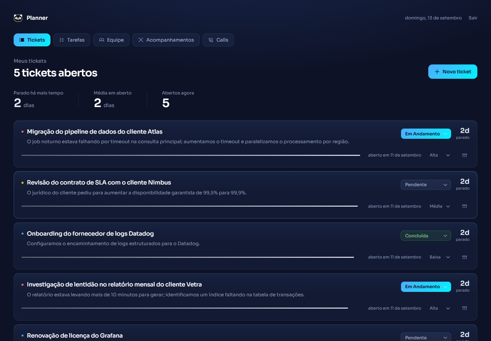
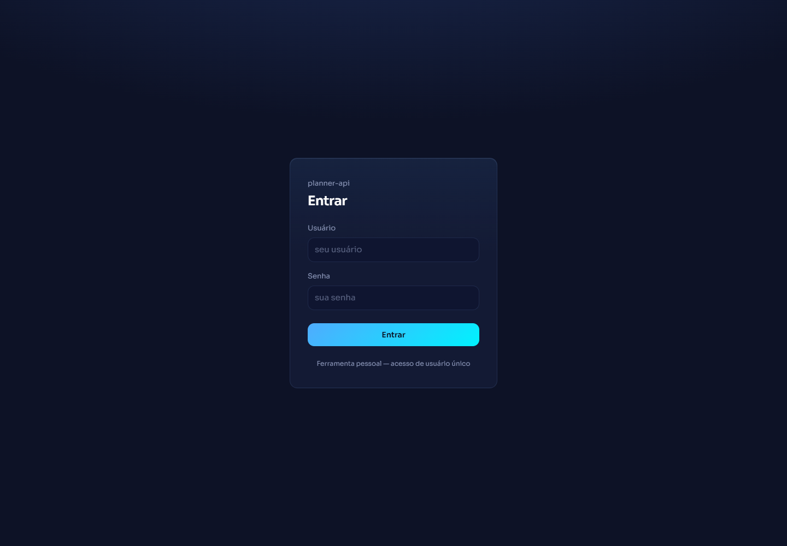
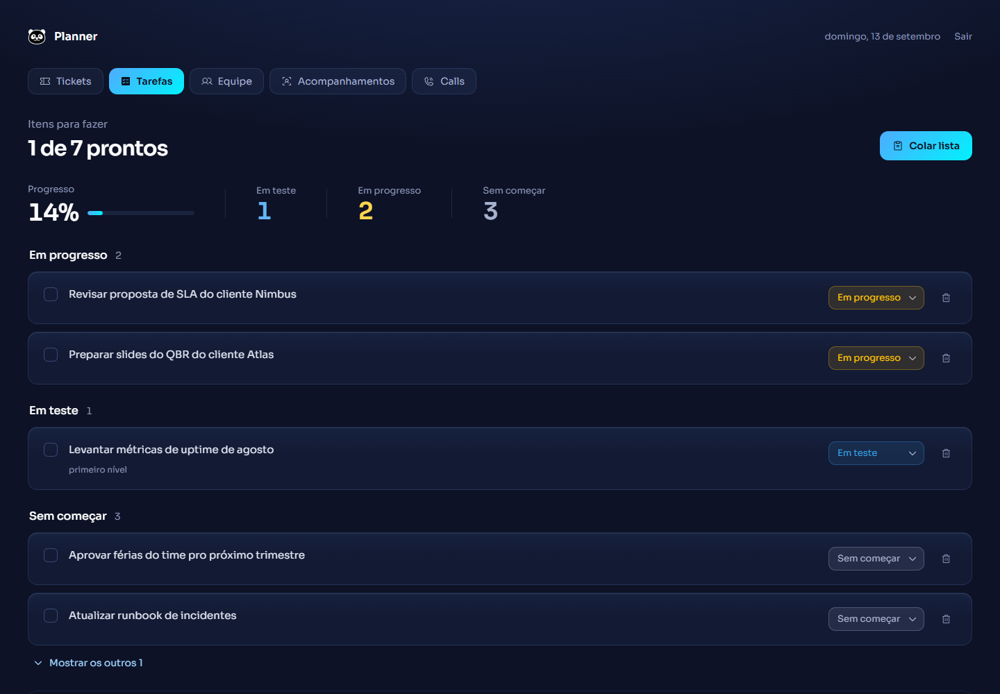
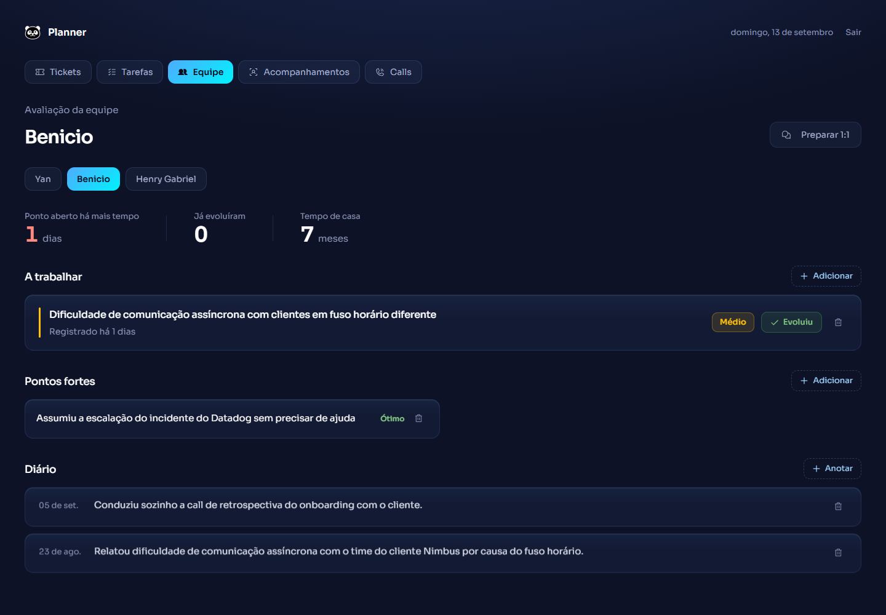
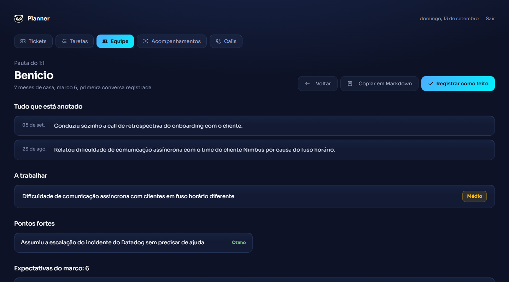
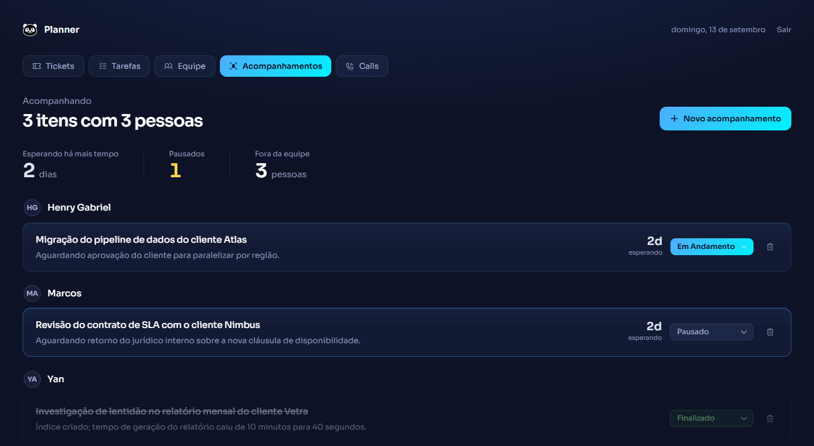
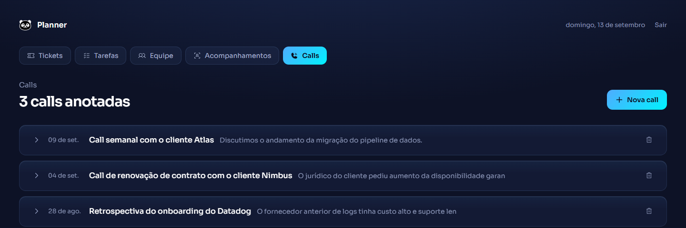

# Planner

Uma ferramenta pessoal para o dia a dia de um team lead: tickets de trabalho,
lista de tarefas, acompanhamento de itens com direct reports, diário da
equipe, notas de reunião e a montagem automática da pauta de 1:1 — a partir do
que já foi registrado, sem precisar reler anotação por anotação.

API em FastAPI + frontend em React, ambos neste repositório.



## O problema

Preparar um 1:1 de verdade significa lembrar o que mudou desde a última
conversa: o que a pessoa fez, o que ficou pendente, o que já evoluiu. Isso
normalmente vive espalhado — em anotações soltas, na cabeça, em nenhum lugar.
O Planner junta tudo automaticamente: registre o dia a dia (tickets, diário,
pontos de avaliação) e a pauta do 1:1 se monta sozinha.

## As telas

| Tela | O que faz |
|---|---|
| **Tickets** | Lista de trabalho em andamento, com prioridade e tempo parado calculado — o ticket mais antigo sobe pro topo sozinho. |
| **Tarefas** | Cole uma lista com marcadores (`* [ ]`, `-`, `1.`) e ela vira itens organizados por status, com indentação virando subnível. |
| **Equipe** | Pontos de avaliação (o que precisa evoluir, pontos fortes) e o diário de cada pessoa — os fatos que sustentam uma conversa de avaliação meses depois. |
| **Pauta do 1:1** | Um clique em "Preparar 1:1" monta a pauta: o que mudou desde a última conversa, pontos abertos, o que já evoluiu — pronta para copiar em Markdown. |
| **Acompanhamentos** | O que está sendo cobrado com qualquer pessoa, dentro ou fora da equipe, agrupado por quem está com o quê. |
| **Calls** | Notas de reunião com autosave — o que foi marcado como item de ação vira tarefa com um clique, sem redigitar. |

<details>
<summary><strong>Screenshots de todas as telas</strong> (clique para expandir)</summary>

**Login**


**Tarefas** — lista colada vira itens organizados por status


**Equipe** — pontos de avaliação e diário por pessoa


**Pauta do 1:1** — montada automaticamente a partir do que já foi registrado


**Acompanhamentos** — agrupado por pessoa, dentro ou fora da equipe


**Calls** — notas de reunião com autosave


*(Dados fictícios gerados com Faker + exemplos escritos à mão, só para demonstração — ver seção de Privacidade.)*

</details>

## Stack

**Backend:** FastAPI, SQLAlchemy 2.0, PostgreSQL, JWT, Docker Compose, pytest.
**Frontend:** React, TypeScript, Vite, Tailwind v4.

Domínio e regras de negócio portados do [Planner v2](../Planner-v2) (React +
IndexedDB, em uso diário real há mais de um ano) — mesmo problema, mesma
lógica já validada por uso real, reescrito do zero com um backend de verdade.
A direção visual ("Vitrine") também vem de lá, reaproveitada quase sem
tradução.

## Como rodar

```bash
cp .env.example .env
# gere um hash de senha (dentro do container, sem precisar instalar nada local):
docker compose run --rm --no-deps api python -c "from app.security import hash_password; print(hash_password('sua-senha'))"
# cole o resultado em ADMIN_PASSWORD_HASH no .env, trocando cada "$" por "$$"
# (ver comentário no .env.example — é um detalhe de como o docker compose lê .env)

docker compose up
```

Isso sobe a API em `http://localhost:8000` (Swagger em `/docs`, se quiser
explorar os endpoints direto). Num terminal separado:

```bash
cd frontend
npm install
npm run dev
```

Abre em `http://localhost:5173` e faça login com o usuário/senha do `.env`.

Num banco vazio e com `SEED_DEMO_DATA=true` (padrão), a API cadastra sozinha um
punhado de pessoas/tickets/tarefas **fictícios** (gerados com Faker) só para ter algo
para explorar. Ligue `SEED_DEMO_DATA=false` para começar realmente vazio.

> Se mudar algo em `app/` e o container parecer não refletir a mudança,
> `docker compose up -d --build api` — o `up` normal reaproveita a imagem já
> construída, não reconstrói sozinho.

## Testes

```bash
# backend
pip install -r requirements-dev.txt
python -m pytest tests -k domain     # puros, sem banco
python -m pytest tests/              # completo, precisa de `docker compose up -d db`

# frontend
cd frontend
npm test
```

## Privacidade — leia antes de usar com dado real

Este projeto guarda avaliação nominal de pessoas de verdade quando usado para
valer. Regras não-negociáveis:

- **Nunca commitar `.env`.** Ele tem o segredo do JWT e a senha do único usuário.
  Só `.env.example`, com placeholders, é versionado.
- **O seed do repositório (`app/seed.py`) só usa nomes gerados por Faker.** Se
  você quiser cadastrar pessoas reais para uso pessoal, cadastre pelas rotas da
  própria API (`POST /pessoas`, etc.) — esse dado fica só no volume Docker do
  seu Postgres local, nunca no git.
- **`criterios.local.json`** (se você criar um, para preencher a seção de
  expectativas da pauta de 1:1 — ver `app/domain/pauta.py`) também nunca é
  versionado: é conteúdo institucional do seu empregador, não deste projeto.
- **Não há multiusuário.** É uma ferramenta pessoal de propósito — uma única
  credencial fixa no `.env`, sem tabela de usuários nem isolamento de dados por
  conta. Não é um produto multi-tenant.

## Fluxo de trabalho

`master` é protegida: push direto é recusado, toda mudança entra por Pull
Request, e só mescla com o CI verde. Não precisa de aprovação de outra pessoa
— é um projeto solo — mas precisa existir o PR, com o diff visível.

```bash
git checkout -b nome-do-que-mudou
# ... commits ...
git push -u origin nome-do-que-mudou
gh pr create --fill
# depois que o CI passar:
gh pr merge --squash --delete-branch
```

## O que foi deixado de fora de propósito

- **Alembic/migrações.** Schema ainda simples e sem dado em produção — o app
  cria as tabelas sozinho no startup. Trocar por migrações no dia em que o
  schema precisar evoluir sem poder recriar o banco do zero.
- **Conteúdo institucional de progressão** (textos de expectativa por marco de
  tempo de casa). É propriedade do empregador de quem usa isto, não deste
  projeto — ver `criterios.local.json` acima.
- **Multiusuário/roles.** Ver seção de privacidade.
- **Router no frontend.** As telas são abas trocadas por estado local, não
  URLs — não há navegação profunda que justifique um roteador aqui.
- **RAG e agente com ferramentas.** Existiram neste repositório e foram
  removidos de propósito, pra virar aprendizado num projeto novo e separado
  sobre uma base pública — ver `RETOMAR.md` para o contexto completo.

---

Documentação mais detalhada: [`PROJETO.md`](PROJETO.md) (histórico e decisões),
[`RETOMAR.md`](RETOMAR.md) (o que vem a seguir), [`frontend/README.md`](frontend/README.md)
(estrutura do frontend).
